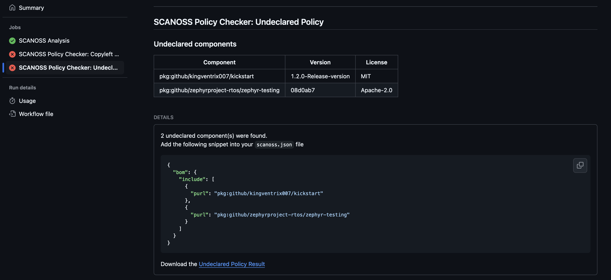

SCANOSS Settings Documentation (This is a new text)
==============================

.. note::
   This feature is available for all SCANOSS clients and integrations.

Changed line
==================================

In the context of using SCANOSS for declared or undeclared component detection, the settings file is a feature to configure the SCANOSS clients and services.

As a way of illustrating the feature, we will take the example of the SCANOSS GitHub Actions integration.

After triggering the Action (in this case, through a pull request), we will get in return a summary of all undeclared components found in our code:

We can see that the action detected 2 undeclared components: "pkg:github/kingventrix007/kickstart" and "pkg:github/zephyrproject-rtos/zephyr-testing". One reason to use the settings file would be to exclude certain components from the scan results, that's the use case we are going to follow for this example.

To implement the settings file in this case, we will create a file named "scanoss.json" in the root directory of our project and inside there we will paste the package url of each component we want to exclude from following scans. 

The format of the "scanoss.json" file goes like this:

.. code-block:: json

      {
   "bom": {
      "include": [
         {
         "purl": "pkg:github/kingventrix007/kickstart"
         },
         {
         "purl": "pkg:github/zephyrproject-rtos/zephyr-testing"
         }
      ]
   }
   }

Now after triggering the action again, we will see that the components previously detected as undeclared will not appear as undeclared anymore.

This is just an example on how someone can benefit from the use of this feature, but there are multiple use cases for using the SCANOSS Settings file (for example, to avoid false positive matches).

How to implement the settings file in SCANOSS clients and services
==================================================================

To implement the use of the settings file, you may need to follow specific instructions for each client/service.

Regarding the clients (e.g. scanoss-py), you can follow the example file creation from this documentation and then use dedicated parameter for this feature (for scanoss-py, that would be *-identify <SCANOSS Setting file path>*). Make sure to check out our `official documentation page <docs.scanoss.com>`_ as well as our `GitHub Organization page <https://github.com/scanoss>`_ for more information.

When it comes to integrations, there is `available documentation <https://scanoss.readthedocs.io/projects/integration-docs/en/latest/>`_  on how to configure and enable the feature.

